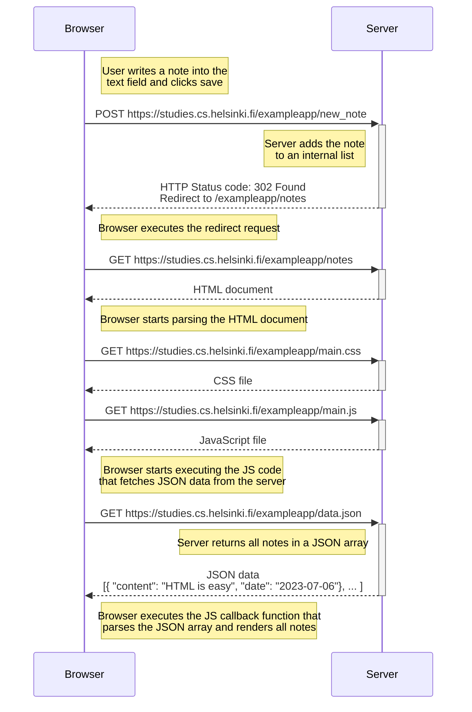

# 0.4: New note diagram

A sequence diagram of a scenario where a user creates a note on this page: https://studies.cs.helsinki.fi/exampleapp/notes.

```mermaid
sequenceDiagram
    participant B as Browser
    participant S as Server

    Note right of B: User writes a note into the<br>text field and clicks save
    B->>+S: POST https://studies.cs.helsinki.fi/exampleapp/new_note
    Note left of S: Server adds the note<br/>to an internal list
    S-->>-B: HTTP Status code: 302 Found<br>Redirect to /exampleapp/notes

    Note right of B: Browser executes the redirect request
    B->>+S: GET https://studies.cs.helsinki.fi/exampleapp/notes
    S-->>-B: HTML document

    Note right of B: Browser starts parsing the HTML document

    B->>+S: GET https://studies.cs.helsinki.fi/exampleapp/main.css
    S-->>-B: CSS file

    B->>+S: GET https://studies.cs.helsinki.fi/exampleapp/main.js
    S-->>-B: JavaScript file

    Note right of B: Browser starts executing the JS code<br>that fetches JSON data from the server

    B->>+S: GET https://studies.cs.helsinki.fi/exampleapp/data.json
    Note left of S: Server returns all notes in a JSON array
    S-->>-B: JSON data<br>[{ "content": "HTML is easy", "date": "2023-07-06"}, ... ]

    Note right of B: Browser executes the JS callback function that<br>parses the JSON array and renders all notes
```
