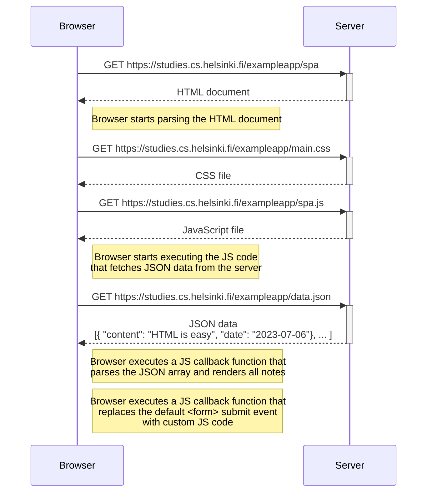

# 0.5: Single page app diagram

A diagram depicting a situation where a user navigates to
https://studies.cs.helsinki.fi/exampleapp/spa.

```mermaid
sequenceDiagram
    participant B as Browser
    participant S as Server

    B->>+S: GET https://studies.cs.helsinki.fi/exampleapp/spa
    S-->>-B: HTML document

    Note right of B: Browser starts parsing the HTML document

    B->>+S: GET https://studies.cs.helsinki.fi/exampleapp/main.css
    S-->>-B: CSS file

    B->>+S: GET https://studies.cs.helsinki.fi/exampleapp/spa.js
    S-->>-B: JavaScript file

    Note right of B: Browser starts executing the JS code<br>that fetches JSON data from the server

    B ->>+S: GET https://studies.cs.helsinki.fi/exampleapp/data.json
    S -->>-B: JSON data<br>[{ "content": "HTML is easy", "date": "2023-07-06"}, ... ]

    %%Note right of B: Browser executes a JS callback function that<br>parses the JSON array and renders all notes

    Note right of B: Browser executes a JS callback function that<br>parses the JSON array and renders all notes

    Note right of B: Browser executes a JS callback function that<br>replaces the default <form> submit event<br> with custom JS code
```
