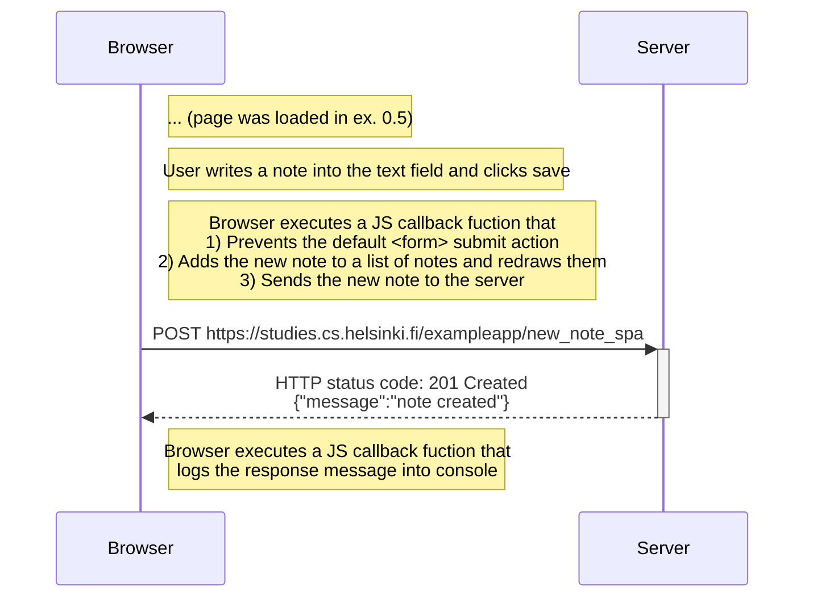

# 0.6: New note in Single page app diagram

A diagram depicting a situation where a user creates a new note on https://studies.cs.helsinki.fi/exampleapp/spa.

```mermaid
sequenceDiagram
    participant B as Browser
    participant S as Server

    Note right of B: ... (page was loaded in ex. 0.5)

    Note right of B: User writes a note into the text field and clicks save

    Note right of B: Browser executes a JS callback fuction that<br>1) Prevents the default <form> submit action<br>2) Adds the new note to a list of notes and redraws them<br>3) Sends the new note to the server

    B->>+S: POST https://studies.cs.helsinki.fi/exampleapp/new_note_spa
    S-->>-B: HTTP status code: 201 Created<br>{"message":"note created"}

    Note right of B: Browser executes a JS callback fuction that<br> logs the response message into console
```
